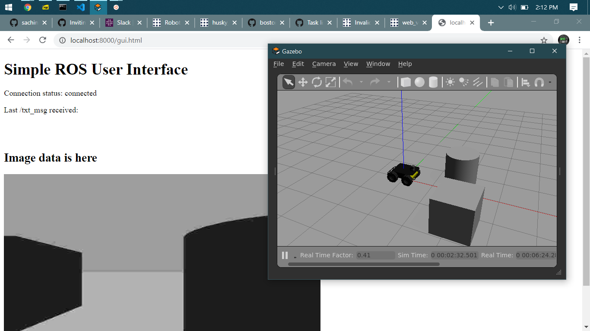
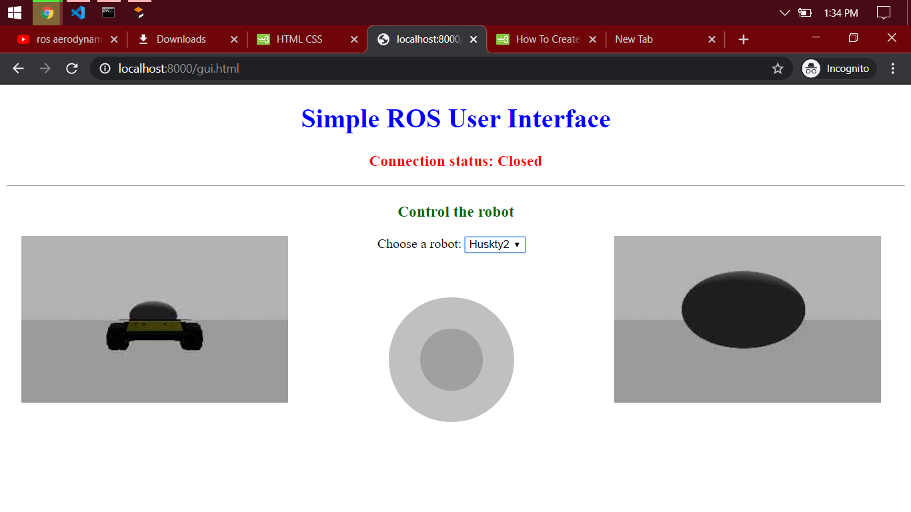

# Robot Teleoperation

Robust outdoor teleoperation to increase efficiency and reduce costs based on ROS

[](https://travis-ci.org/sachinkum0009/robot-teleoperation)

### To Do
- [x] Step to run <b>Robot</b>
- [x] Setup web server
- [x] Publish Image Data to web browser
- [x] Publish topic through web page
- [x] GUI for the robot
- Launch the simulator
```
roslaunch turtle_pkg two_turtlebot3.launch  
```
- Now launch the websocket launch file
```
roslaunch robot_gui_bridge websocket.launch
```
- After that go to the gui directory inside the robot_gui_bidge and enter the command
```
python3 -m http.server
```
- Now open the web browser and locate the following address
```
localhost:8000
```

<hr>

## Test Result 
Publishing the image stream to the web




## UI Changes

